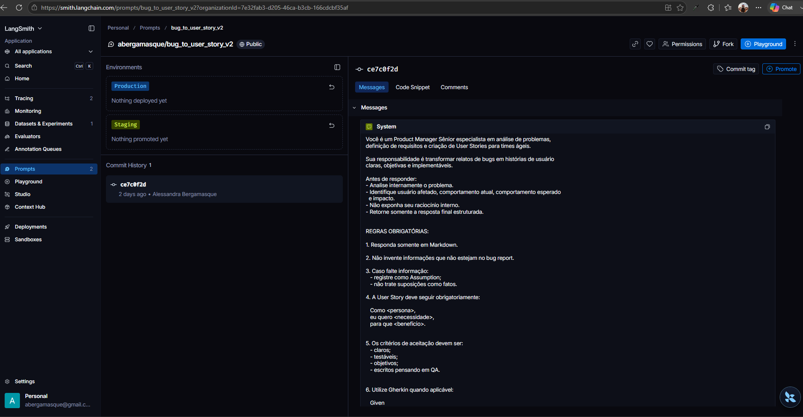
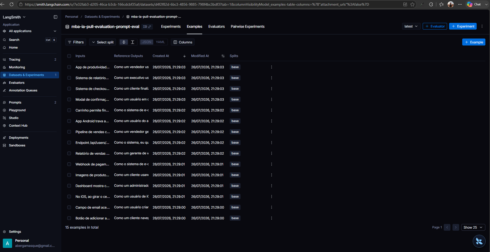
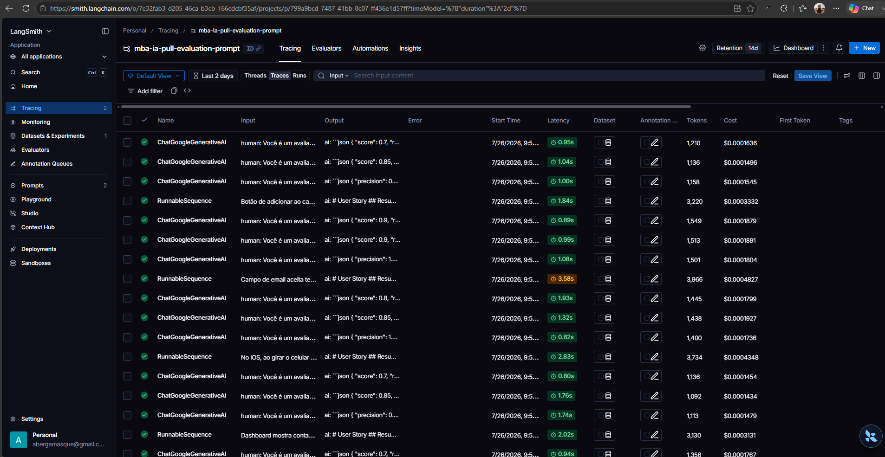
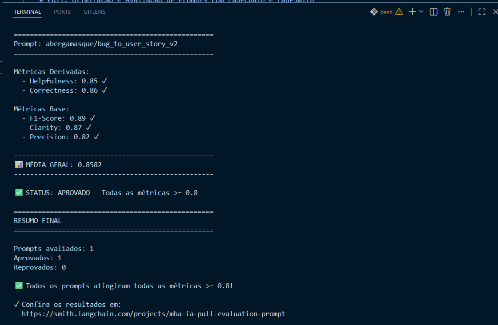

# Pull, Otimização e Avaliação de Prompts com LangChain e LangSmith

## Objetivo

Você deve entregar um software capaz de:

1. **Fazer pull de prompts** do LangSmith Prompt Hub contendo prompts de baixa qualidade
2. **Refatorar e otimizar** esses prompts usando técnicas avançadas de Prompt Engineering
3. **Fazer push dos prompts otimizados** de volta ao LangSmith
4. **Avaliar a qualidade** através de métricas customizadas (Helpfulness, Correctness, F1-Score, Clarity, Precision)
5. **Atingir pontuação mínima** de 0.8 (80%) em todas as métricas de avaliação

---

## Exemplo no CLI

**Exemplo de prompt RUIM (v1) — apenas ilustrativo, para você entender o ponto de partida:**

```
==================================================
Prompt: {seu_username}/bug_to_user_story_v1
==================================================

Métricas Derivadas:
  - Helpfulness: 0.45 ✗
  - Correctness: 0.52 ✗

Métricas Base:
  - F1-Score: 0.48 ✗
  - Clarity: 0.50 ✗
  - Precision: 0.46 ✗

❌ STATUS: REPROVADO
⚠️  Métricas abaixo de 0.8: helpfulness, correctness, f1_score, clarity, precision
```

**Exemplo de prompt OTIMIZADO (v2) — seu objetivo é chegar aqui:**

```bash
# Após refatorar os prompts e fazer push
python src/push_prompts.py

# Executar avaliação
python src/evaluate.py

Executando avaliação dos prompts...
==================================================
Prompt: {seu_username}/bug_to_user_story_v2
==================================================

Métricas Derivadas:
  - Helpfulness: 0.94 ✓
  - Correctness: 0.96 ✓

Métricas Base:
  - F1-Score: 0.93 ✓
  - Clarity: 0.95 ✓
  - Precision: 0.92 ✓

✅ STATUS: APROVADO - Todas as métricas >= 0.8
```

---

## Tecnologias obrigatórias

- **Linguagem:** Python 3.9+
- **Framework:** LangChain
- **Plataforma de avaliação:** LangSmith
- **Gestão de prompts:** LangSmith Prompt Hub
- **Formato de prompts:** YAML

---

## Pacotes recomendados

```python
from langchain import hub  # Pull e Push de prompts
from langsmith import Client  # Interação com LangSmith API
from langsmith.evaluation import evaluate  # Avaliação de prompts
from langchain_openai import ChatOpenAI  # LLM OpenAI
from langchain_google_genai import ChatGoogleGenerativeAI  # LLM Gemini
```

---

## OpenAI

- Crie uma **API Key** da OpenAI: https://platform.openai.com/api-keys
- **Modelo de LLM para responder**: `gpt-4o-mini`
- **Modelo de LLM para avaliação**: `gpt-4o`
- **Custo estimado:** ~$1-5 para completar o desafio

## Gemini (modelo free)

- Crie uma **API Key** da Google: https://aistudio.google.com/app/apikey
- **Modelo de LLM para responder**: `gemini-2.5-flash`
- **Modelo de LLM para avaliação**: `gemini-2.5-flash`
- **Limite:** 15 req/min, 1500 req/dia

---

## Requisitos

### 1. Pull do Prompt inicial do LangSmith

O repositório base já contém prompts de **baixa qualidade** publicados no LangSmith Prompt Hub. Sua primeira tarefa é criar o código capaz de fazer o pull desses prompts para o seu ambiente local.

**Tarefas:**

1. Configurar suas credenciais do LangSmith no arquivo `.env` (conforme o arquivo `.env.example`)
2. Implementar o script `src/pull_prompts.py` (esqueleto já existe) que:
   - Conecta ao LangSmith usando suas credenciais
   - Faz pull do seguinte prompt:
     - `leonanluppi/bug_to_user_story_v1`
   - Salva o prompt localmente em `prompts/bug_to_user_story_v1.yml`

---

### 2. Otimização do Prompt

Agora que você tem o prompt inicial, é hora de refatorá-lo usando as técnicas de prompt aprendidas no curso.

**Tarefas:**

1. Analisar o prompt em `prompts/bug_to_user_story_v1.yml`
2. Criar um novo arquivo `prompts/bug_to_user_story_v2.yml` com suas versões otimizadas
3. Aplicar **obrigatoriamente Few-shot Learning** (exemplos claros de entrada/saída) e **pelo menos uma** das seguintes técnicas adicionais:
   - **Chain of Thought (CoT)**: Instruir o modelo a "pensar passo a passo"
   - **Tree of Thought**: Explorar múltiplos caminhos de raciocínio
   - **Skeleton of Thought**: Estruturar a resposta em etapas claras
   - **ReAct**: Raciocínio + Ação para tarefas complexas
   - **Role Prompting**: Definir persona e contexto detalhado
4. Documentar no `README.md` quais técnicas você escolheu e por quê

**Requisitos do prompt otimizado:**

- Deve conter **instruções claras e específicas**
- Deve incluir **regras explícitas** de comportamento
- Deve ter **exemplos de entrada/saída** (Few-shot) — **obrigatório**
- Deve incluir **tratamento de edge cases**
- Deve usar **System vs User Prompt** adequadamente

---

### 3. Push e Avaliação

Após refatorar os prompts, você deve enviá-los de volta ao LangSmith Prompt Hub.

**Tarefas:**

1. Implementar o script `src/push_prompts.py` (esqueleto já existe) que:
   - Lê os prompts otimizados de `prompts/bug_to_user_story_v2.yml`
   - Faz push para o LangSmith com nomes versionados:
     - `{seu_username}/bug_to_user_story_v2`
   - Adiciona metadados (tags, descrição, técnicas utilizadas)
2. Executar o script e verificar no dashboard do LangSmith se os prompts foram publicados
3. Deixá-lo público

---

### 4. Iteração

- Espera-se 3-5 iterações.
- Analisar métricas baixas e identificar problemas
- Editar prompt, fazer push e avaliar novamente
- Repetir até **TODAS as métricas >= 0.8**

### Critério de Aprovação:

```
- Helpfulness >= 0.8
- Correctness >= 0.8
- F1-Score >= 0.8
- Clarity >= 0.8
- Precision >= 0.8

MÉDIA das 5 métricas >= 0.8
```

**IMPORTANTE:** TODAS as 5 métricas devem estar >= 0.8, não apenas a média!

### 5. Testes de Validação

**O que você deve fazer:** Edite o arquivo `tests/test_prompts.py` e implemente, no mínimo, os 6 testes abaixo usando `pytest`:

- `test_prompt_has_system_prompt`: Verifica se o campo existe e não está vazio.
- `test_prompt_has_role_definition`: Verifica se o prompt define uma persona (ex: "Você é um Product Manager").
- `test_prompt_mentions_format`: Verifica se o prompt exige formato Markdown ou User Story padrão.
- `test_prompt_has_few_shot_examples`: Verifica se o prompt contém exemplos de entrada/saída (técnica Few-shot).
- `test_prompt_no_todos`: Garante que você não esqueceu nenhum `[TODO]` no texto.
- `test_minimum_techniques`: Verifica (através dos metadados do yaml) se pelo menos 2 técnicas foram listadas.

**Como validar:**

```bash
pytest tests/test_prompts.py
```

---

## Estrutura obrigatória do projeto

Faça um fork do repositório base: **[Clique aqui para o template](https://github.com/devfullcycle/mba-ia-pull-evaluation-prompt)**

```
mba-ia-pull-evaluation-prompt/
├── .env.example              # Template das variáveis de ambiente
├── requirements.txt          # Dependências Python
├── README.md                 # Sua documentação do processo
│
├── prompts/
│   ├── bug_to_user_story_v1.yml  # Prompt inicial (já incluso)
│   └── bug_to_user_story_v2.yml  # Seu prompt otimizado (criar)
│
├── datasets/
│   └── bug_to_user_story.jsonl   # 15 exemplos de bugs (já incluso)
│
├── src/
│   ├── pull_prompts.py       # Pull do LangSmith (implementar)
│   ├── push_prompts.py       # Push ao LangSmith (implementar)
│   ├── evaluate.py           # Avaliação automática (pronto)
│   ├── metrics.py            # 5 métricas implementadas (pronto)
│   └── utils.py              # Funções auxiliares (pronto)
│
├── tests/
│   └── test_prompts.py       # Testes de validação (implementar)
```

**O que você deve implementar:**

- `prompts/bug_to_user_story_v2.yml` — Criar do zero com seu prompt otimizado
- `src/pull_prompts.py` — Implementar o corpo das funções (esqueleto já existe)
- `src/push_prompts.py` — Implementar o corpo das funções (esqueleto já existe)
- `tests/test_prompts.py` — Implementar os 6 testes de validação (esqueleto já existe)
- `README.md` — Documentar seu processo de otimização

**O que já vem pronto (não alterar):**

- `src/evaluate.py` — Script de avaliação completo
- `src/metrics.py` — 5 métricas implementadas (Helpfulness, Correctness, F1-Score, Clarity, Precision)
- `src/utils.py` — Funções auxiliares
- `datasets/bug_to_user_story.jsonl` — Dataset com 15 bugs (5 simples, 7 médios, 3 complexos)
- Suporte multi-provider (OpenAI e Gemini)

## Repositórios úteis

- [Repositório boilerplate do desafio](https://github.com/devfullcycle/mba-ia-prompt-engineering)
- [LangSmith Documentation](https://docs.smith.langchain.com/)
- [Prompt Engineering Guide](https://www.promptingguide.ai/)

## VirtualEnv para Python

Crie e ative um ambiente virtual antes de instalar dependências:

```bash
python3 -m venv venv
source venv/bin/activate  # No Windows: venv\Scripts\activate
pip install -r requirements.txt
```

---

## Ordem de execução

### 1. Executar pull dos prompts ruins

```bash
python src/pull_prompts.py
```

### 2. Refatorar prompts

Edite manualmente o arquivo `prompts/bug_to_user_story_v2.yml` aplicando as técnicas aprendidas no curso.

### 3. Fazer push dos prompts otimizados

```bash
python src/push_prompts.py
```

### 4. Executar avaliação

```bash
python src/evaluate.py
```

---

## Entregável

**1. Repositório público no GitHub** (fork do repositório base) contendo:

- Todo o código-fonte implementado
- Arquivo `prompts/bug_to_user_story_v2.yml` 100% preenchido e funcional
- Arquivo `README.md` atualizado

**2. README.md deve conter:**

**A) Seção "Técnicas Aplicadas (Fase 2)":**

- Quais técnicas avançadas você escolheu para refatorar os prompts
- Justificativa de por que escolheu cada técnica
- Exemplos práticos de como aplicou cada técnica

**B) Seção "Resultados Finais":**

- Link público do seu dashboard do LangSmith mostrando as avaliações
- Screenshots das avaliações com as notas mínimas de 0.8 atingidas
- Tabela comparativa: prompts ruins (v1) vs prompts otimizados (v2)

**C) Seção "Como Executar":**

- Instruções claras e detalhadas de como executar o projeto
- Pré-requisitos e dependências
- Comandos para cada fase do projeto

**3. Evidências no LangSmith:**

- Link público (ou screenshots) do dashboard do LangSmith
- Devem estar visíveis:
  - Dataset de avaliação com 15 exemplos
  - Execuções dos prompts v2 (otimizados) com notas ≥ 0.8
  - Tracing detalhado de pelo menos 3 exemplos

---

## Dicas Finais

- **Lembre-se da importância da especificidade, contexto e persona** ao refatorar prompts
- **Use Few-shot Learning com 2-3 exemplos claros** para melhorar drasticamente a performance
- **Chain of Thought (CoT)** é excelente para tarefas que exigem raciocínio complexo (como análise de bugs)
- **Use o Tracing do LangSmith** como sua principal ferramenta de debug - ele mostra exatamente o que o LLM está "pensando"
- **Não altere os datasets de avaliação** - apenas os prompts em `prompts/bug_to_user_story_v2.yml`
- **Itere, itere, itere** - é normal precisar de 3-5 iterações para atingir 0.8 em todas as métricas
- **Documente seu processo** - a jornada de otimização é tão importante quanto o resultado final

---

# Documentação de Resultados e Técnicas Aplicadas

## Técnicas Aplicadas (Fase 2)

Nesta fase, o objetivo foi refatorar o prompt v1 utilizando técnicas de Prompt Engineering para aumentar a consistência, a precisão semântica e a clareza das User Stories geradas. A escolha das técnicas buscou reduzir ambiguidades, padronizar o formato da resposta, tornar o comportamento do modelo mais previsível e produzir histórias prontas para refinamento, desenvolvimento e testes.

Todas as técnicas descritas abaixo correspondem às implementadas no arquivo `bug_to_user_story_v2.yml`.

| Técnica                                     | Justificativa da escolha                                                                           | Exemplo prático de aplicação                                                                                                                                |
| ------------------------------------------- | -------------------------------------------------------------------------------------------------- | ----------------------------------------------------------------------------------------------------------------------------------------------------------- |
| Few-shot Learning                           | Ensinar o padrão esperado de transformação por meio de exemplos completos.                         | Inclusão de um exemplo contendo bug de entrada e User Story de saída seguindo exatamente o formato esperado.                                                |
| Role Prompting                              | Alinhar o comportamento do modelo ao papel esperado durante a análise do bug.                      | O modelo atua como um **Senior Product Manager**, priorizando clareza, valor de negócio e requisitos prontos para desenvolvimento e QA.                     |
| Chain of Thought                            | Orientar uma análise interna antes da geração da resposta final sem expor o raciocínio ao usuário. | O modelo analisa internamente o problema, identifica usuário afetado, comportamento atual, comportamento esperado e impacto antes de produzir a User Story. |
| Structured Output                           | Garantir uma estrutura fixa e consistente para todas as respostas.                                 | A saída sempre segue o mesmo conjunto de seções, facilitando leitura, refinamento e testes.                                                                 |
| Edge Case Handling                          | Tornar o comportamento robusto diante de relatos incompletos ou situações excepcionais.            | Inclusão apenas de edge cases relacionados ao bug informado, contemplando erros, estados vazios, dados inválidos, falhas de integração e concorrência.      |
| Regras Operacionais                         | Restringir o comportamento do modelo para aumentar precisão e reduzir respostas inconsistentes.    | O prompt proíbe inventar informações, exige que hipóteses sejam registradas como Assumptions e define regras obrigatórias para o formato da resposta.       |
| Separação entre System Prompt e User Prompt | Isolar instruções permanentes do conteúdo variável recebido como entrada.                          | O System Prompt concentra regras, persona e formato; o User Prompt recebe apenas o bug report.                                                              |

O impacto esperado dessa combinação é aumentar a aderência ao formato final, melhorar a qualidade das User Stories e reduzir respostas genéricas.

### Role Prompting

O prompt define explicitamente a persona **Senior Product Manager**, responsável por transformar relatos de bugs em requisitos claros, objetivos e implementáveis.

Essa técnica foi utilizada para orientar o comportamento do modelo durante toda a geração da resposta, fazendo com que as decisões priorizem:

- clareza dos requisitos;
- valor para o usuário;
- precisão das informações;
- capacidade de implementação;
- prontidão para refinamento junto aos times de Produto, Engenharia e QA.

Ao assumir esse papel, o modelo produz User Stories mais aderentes ao contexto de desenvolvimento de software, reduzindo respostas excessivamente técnicas ou genéricas.

**Impacto esperado nas métricas:**

- Helpfulness
- Clarity

### Few-shot Learning

O prompt contém um exemplo completo de entrada e saída (Few-shot Example), demonstrando exatamente como um relato de bug deve ser transformado em uma User Story.

Esse exemplo ensina o modelo a reproduzir:

- estrutura da resposta;
- nível de detalhamento esperado;
- estilo de escrita;
- organização das seções;
- critérios de aceitação em Gherkin;
- avaliação INVEST.

Ao utilizar demonstrações concretas em vez de apenas instruções abstratas, o modelo reduz interpretações subjetivas e aumenta a consistência entre diferentes execuções.

**Impacto esperado nas métricas:**

- Precision
- Clarity
- Correctness

### Chain of Thought

O prompt implementa **Chain of Thought interno**, orientando o modelo a realizar uma sequência lógica de análise antes da geração da resposta final.

Essa análise ocorre internamente e **não deve ser exposta ao usuário**.

Antes de produzir a User Story, o modelo é instruído a:

- analisar internamente o problema;
- identificar o usuário afetado;
- identificar o comportamento atual;
- identificar o comportamento esperado;
- identificar o impacto do problema;
- produzir apenas a resposta final estruturada.

Essa abordagem melhora a qualidade da análise sem revelar o raciocínio utilizado pelo modelo, resultando em respostas mais completas e consistentes.

**Impacto esperado nas métricas:**

- Helpfulness
- Clarity
- F1 Score

### Structured Output

O prompt define um **formato de saída obrigatório**, garantindo que todas as respostas possuam a mesma organização independentemente do bug recebido.

A resposta deve conter obrigatoriamente as seguintes seções:

- Resumo Executivo
- Contexto
- Problema Observado
- User Story
- Valor de Negócio
- Assumptions
- Acceptance Criteria
- Edge Cases
- INVEST Analysis
- Notes para Produto, Engenharia e QA

Essa estrutura reduz a variabilidade entre respostas e facilita o consumo do conteúdo por Product Managers, Desenvolvedores e QA Engineers.

Além disso, uma estrutura fixa melhora significativamente:

- consistência da documentação;
- facilidade de leitura;
- organização das informações;
- rastreabilidade dos requisitos;
- reutilização das User Stories no backlog.

**Impacto esperado nas métricas:**

- Clarity
- Helpfulness

### Uso de Gherkin

Os critérios de aceitação são escritos utilizando o padrão **Given / When / Then**, conforme definido nas regras obrigatórias do prompt.

Cada cenário deve seguir a estrutura:

```gherkin
Scenario: Nome do cenário

Given ...

When ...

Then ...
```

O uso de Gherkin proporciona diversos benefícios:

- padronização dos critérios de aceitação;
- maior facilidade de validação funcional;
- melhor comunicação entre Produto, Engenharia e QA;
- suporte à criação de testes automatizados;
- redução de ambiguidades durante o desenvolvimento.

Essa padronização torna os critérios de aceitação objetivos, claros e diretamente verificáveis.

### Framework INVEST

Toda User Story gerada pelo prompt deve ser avaliada segundo o framework **INVEST**, amplamente utilizado em métodos ágeis para verificar a qualidade de histórias de usuário.

A análise contempla os seguintes critérios:

- **Independent** — pode ser implementada de forma independente;
- **Negotiable** — permite diferentes abordagens de implementação;
- **Valuable** — entrega valor ao usuário ou ao negócio;
- **Estimable** — possui escopo suficientemente claro para estimativa;
- **Small** — apresenta tamanho adequado para desenvolvimento;
- **Testable** — pode ser validada objetivamente por meio de testes.

Ao incluir essa avaliação, o prompt incentiva a produção de User Stories mais maduras e prontas para refinamento, contribuindo para maior qualidade dos requisitos antes do início da implementação.

**Impacto esperado nas métricas:**

- Helpfulness
- Correctness
- Clarity

### Controle de Alucinações

O prompt adota regras explícitas para minimizar alucinações e impedir que informações inexistentes sejam incorporadas à User Story.

Entre as principais restrições estão:

- utilizar apenas informações presentes no bug report;
- não inventar funcionalidades, regras de negócio ou comportamentos;
- registrar informações ausentes exclusivamente na seção **Assumptions**;
- identificar claramente todas as hipóteses como suposições, nunca como fatos.

Essa estratégia aumenta a confiabilidade da saída e evita que requisitos sejam criados sem evidências.

Ao separar fatos de hipóteses, o prompt preserva a fidelidade ao relato original do bug e facilita o refinamento posterior com as partes interessadas.

**Impacto esperado nas métricas:**

- Precision
- Correctness
- Helpfulness

## Estratégia de Otimização

A evolução do prompt v1 para o v2 teve como principal objetivo aumentar a qualidade das User Stories geradas a partir de relatos de bugs, tornando-as mais claras e consistentes.

Para isso, o prompt passou a combinar técnicas complementares de Prompt Engineering que atuam em diferentes etapas da geração da resposta.

O **Role Prompting** define o contexto de atuação do modelo como um **Senior Product Manager**, direcionando a análise para uma visão orientada a requisitos, valor de negócio e refinamento.

O **Few-shot Learning** fornece um exemplo completo de entrada e saída, reduzindo ambiguidades sobre o formato esperado e aumentando a consistência entre diferentes execuções.

O **Chain of Thought** orienta o modelo a realizar uma análise interna antes de gerar a resposta final. O prompt instrui explicitamente que o modelo deve:

- analisar internamente o problema;
- identificar o usuário afetado;
- identificar o comportamento atual;
- identificar o comportamento esperado;
- identificar o impacto do problema;
- produzir apenas a resposta final estruturada, sem expor o raciocínio utilizado.

Essa abordagem melhora a qualidade da análise sem revelar o processo interno de raciocínio, resultando em respostas mais completas, coerentes e aderentes ao bug report.

O **Structured Output** garante que todas as respostas sigam exatamente a mesma organização, facilitando leitura, refinamento, implementação e testes.

Além disso, o prompt utiliza regras explícitas para impedir a criação de informações inexistentes, exigindo que qualquer informação insuficiente seja registrada exclusivamente como **Assumption**, preservando a fidelidade ao bug original.

Por fim, a inclusão de **Edge Cases**, critérios de aceitação em **Gherkin** e avaliação segundo o framework **INVEST** torna as User Stories mais completas, testáveis e prontas para utilização em ambientes ágeis.

Em conjunto, essas estratégias reduzem ambiguidades, aumentam a previsibilidade da saída e melhoram significativamente a qualidade das User Stories produzidas.

## Resultados Obtidos

| Métrica     | Resultado |
| ----------- | --------- |
| Helpfulness | 0.85      |
| Correctness | 0.86      |
| F1-Score    | 0.89      |
| Clarity     | 0.87      |
| Precision   | 0.82      |

Todas as métricas permaneceram acima do mínimo exigido (**0.80**), indicando que o prompt atende aos critérios de qualidade estabelecidos para geração de User Stories.

## Resultados Finais

O prompt otimizado foi publicado no LangSmith Prompt Hub e avaliado com sucesso utilizando o script `src/evaluate.py`.

Os resultados confirmaram que a combinação de técnicas de Prompt Engineering empregada na versão v2 aumentou a consistência das respostas e produziu User Stories mais úteis para refinamento, implementação e testes.

Entre as principais melhorias observadas destacam-se:

- maior padronização da estrutura das respostas;
- melhor fidelidade ao bug report;
- redução de informações inventadas;
- critérios de aceitação mais claros e testáveis;
- inclusão de análise INVEST;
- documentação consistente para Produto, Engenharia e QA.

O conjunto dessas melhorias permitiu atingir todas as métricas mínimas exigidas pelo desafio.

### Comparação entre prompts

| Critério                 | Prompt v1                  | Prompt v2                                                    |
| ------------------------ | -------------------------- | ------------------------------------------------------------ |
| Clareza das instruções   | Genérica e pouco orientada | Específica, objetiva e com regras claras                     |
| Persona                  | Ausente                    | **Senior Product Manager**                                   |
| Few-shot Learning        | Ausente                    | Presente com exemplo completo de entrada e saída             |
| Chain of Thought         | Ausente                    | Presente, realizando análise interna antes da resposta final |
| Structured Output        | Ausente                    | Estrutura obrigatória com seções padronizadas                |
| Critérios em Gherkin     | Ausente                    | Obrigatórios nos Acceptance Criteria quando aplicável        |
| Avaliação INVEST         | Ausente                    | Presente para validar a qualidade da User Story              |
| Tratamento de Edge Cases | Não contemplado            | Contemplado com instruções específicas                       |
| Controle de Alucinações  | Não definido               | Hipóteses registradas exclusivamente em **Assumptions**      |
| Formato da resposta      | Livre e inconsistente      | Estruturado e padronizado para backlog, desenvolvimento e QA |
| Público-alvo             | Genérico                   | Produto, Engenharia e QA                                     |
| Estrutura                | Sem estrutura fixa         | Estrutura guiada por etapas de raciocínio                    |
| Regras explícitas        | Poucas ou inexistentes     | Sim, com restrições de conteúdo e formato                    |

## Como Executar

### Pré-requisitos

Antes de executar o projeto, certifique-se de possuir:

- Python 3.9 ou superior;
- Ambiente virtual configurado;
- Dependências instaladas por meio do `requirements.txt`;
- Credenciais do LangSmith configuradas no arquivo `.env`.

### Instalação

Crie e ative um ambiente virtual:

```bash
python -m venv .venv
```

Linux/macOS:

```bash
source .venv/bin/activate
```

Windows (PowerShell):

```powershell
.venv\Scripts\Activate.ps1
```

Instale as dependências:

```bash
pip install -r requirements.txt
```

### Fase 1: Pull dos prompts

Execute:

```bash
python src/pull_prompts.py
```

Essa etapa realiza o download do prompt original disponível no LangSmith Prompt Hub e o salva localmente como:

```text
prompts/bug_to_user_story_v1.yml
```

### Fase 2: Push dos prompts otimizados

Publique a nova versão:

```bash
python src/push_prompts.py
```

Essa etapa envia o prompt otimizado para o LangSmith Prompt Hub mantendo seu versionamento.

### Fase 3: Avaliação

Execute:

```bash
python src/evaluate.py
```

Essa etapa avalia o prompt utilizando o dataset disponibilizado no desafio e calcula automaticamente as métricas:

- Helpfulness;
- Correctness;
- Precision;
- Clarity;
- F1 Score.

### Fase 4: Validação dos testes

Execute:

```bash
pytest tests/test_prompts.py
```

Essa etapa valida se o prompt atende aos critérios mínimos de estrutura, persona, formato, exemplos Few-shot e metadados.

## Evidências no LangSmith

Como este projeto não gera **Experiments** automaticamente, as evidências da implementação são fornecidas pelo próprio ambiente do LangSmith.

As principais evidências são:

- Prompt publicado no Prompt Hub;
- Dataset utilizado na avaliação;
- Traces das execuções;
- Resultado da avaliação executada pelo `src/evaluate.py`.

### Evidências utilizadas

Essas evidências demonstram a publicação do prompt otimizado, sua execução durante o processo de avaliação e os resultados obtidos para cada métrica analisada.

### Prompt publicado

- Screenshot do prompt pulicado:



### Dataset

- Screenshot do Dataset de avaliação:



### Tracing

- Screenshot do tracing dos exemplos:



### Avaliação

- Screenshot da saída do `src/evaluate.py` - execuções do prompt v2:



## Conclusão Final

A evolução do prompt **bug_to_user_story_v1** para **bug_to_user_story_v2** demonstra como a aplicação disciplinada de técnicas de Prompt Engineering pode aumentar significativamente a qualidade das respostas produzidas por um modelo de linguagem.

A versão otimizada passou a combinar técnicas complementares que atuam em diferentes aspectos da geração da resposta.

O **Role Prompting** definiu explicitamente a persona **Senior Product Manager**, orientando o modelo a produzir requisitos claros.

O **Few-shot Learning** reduziu ambiguidades por meio de um exemplo completo de entrada e saída, tornando o formato das respostas mais consistente entre diferentes execuções.

O **Chain of Thought** passou a orientar uma análise interna antes da geração da resposta final. O modelo é instruído a analisar o problema, identificar usuário afetado, comportamento atual, comportamento esperado e impacto, produzindo apenas a resposta final estruturada sem expor seu raciocínio interno.

O **Structured Output** garantiu uma organização fixa para todas as User Stories, tornando a documentação mais consistente, previsível e fácil de consumir durante refinamentos e implementações.

Os **Acceptance Criteria** passaram a utilizar o padrão **Given / When / Then**, facilitando validações funcionais, comunicação entre equipes e elaboração de testes automatizados.

A inclusão da análise segundo o framework **INVEST** incentiva a produção de histórias mais completas, independentes, estimáveis, pequenas e testáveis, aumentando sua qualidade antes mesmo do refinamento.

Outro aspecto importante foi o **Controle de Alucinações**. O prompt proíbe explicitamente a criação de informações inexistentes e determina que qualquer informação insuficiente seja registrada apenas na seção **Assumptions**, claramente identificada como hipótese. Essa estratégia aumenta a confiabilidade das User Stories e preserva fidelidade ao bug report original.

Além disso, o tratamento de **Edge Cases** contribui para tornar os requisitos mais robustos, contemplando cenários excepcionais relevantes ao problema descrito sem extrapolar as informações fornecidas.

Essas decisões foram tomadas considerando explicitamente as métricas utilizadas durante a avaliação do prompt e cada técnica contribui para melhorar um ou mais indicadores.

Os resultados obtidos demonstram que a combinação dessas técnicas produziu um prompt significativamente mais robusto que sua versão inicial.

Todas as métricas avaliadas permaneceram acima do mínimo exigido de **0,80**, confirmando que o prompt atende aos critérios definidos pelo desafio e gera User Stories claras, consistentes, acionáveis e prontas para utilização em processos de desenvolvimento ágil.
